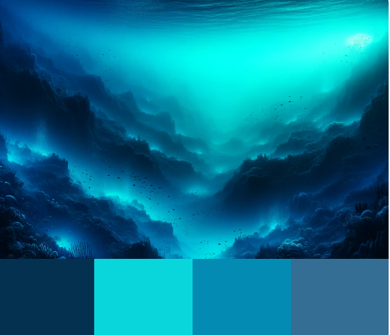
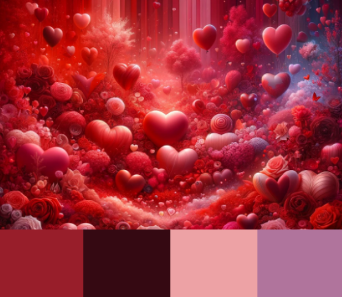

# Ultimate WLED Scenes Collection: Pre-configured Brilliance to a World of Vivid Light Scenes


**Welcome to a World of Vivid Light Scenes!**

Dive into my carefully curated repository, showcasing a diverse collection of WLED scenes, complete with their API-Command (JSON configurations) and vibrant images that perfectly capture each scene's essence. This collection, inspired by the dynamics and diversity of the Phillips Hue app scene images, offers you a palette of colors and effects to transform your home into whatever atmosphere you choose.

I've designed each scene with attention to detail, featuring a preset selection of colors and effects that work without specific segment settings. This makes them universally applicable to almost any WLED installation. You have the freedom to adjust the effects' speed to your liking, creating your own perfect lighting mood.

I invite you to explore this collection, find your favorites, and modify them as you wish. Share your experiences and own creations with the community, to enrich the world of WLED scenes together. Enjoy discovering and creating!


## Directory Structure

- **Bilder**: This folder contains images of the WLED Scenes.
- **Bilder_clean**: This folder contains images of the WLED Scenes, without the color palette.
- **API-Commands**: This folder contains the JSON structures of the WLED presets.

## Installation


1. Go to the preset page in your WLED web interface.
   
2. Click on the "+" symbol to create a new preset and change the name to the corresponding scene.
   
3. Then, click on the newly created preset to access the API command.
   
4. Now, delete the old code and paste the JSON code of the corresponding scene here. You can find it either in the "API Commands" folder or in the code field below each scene image. IMPORTANT: There should be no spaces remaining in the API command, as this may cause crashes due to syntax errors.
   
5. Finally, click on "Save", and you're done.

## WLED-Scenes

Here is a list of available WLED Scenes:


##  **Starry Night**: 

An effect depicting the stars of a clear night.

  
  
```json
{"bri":120,"seg":[{"id":0,"col":[[0,0,255],[255,255,0],[0,255,0]],"fx":95,"sx":6,"ix":180,"pal":5}]}
```

##  **Ocean Breeze**: 

An effect that captures the soothing atmosphere of a sea breeze.

  
  
```json
{"bri":100,"seg":[{"id":0,"col":[[0,255,255],[0,0,255],[255,255,255]],"fx":43,"sx":150,"ix":200,"pal":5}]}
```

##  **Lava Stream**: 

An effect that simulates the flowing movement of lava.

  
  
```json
{"bri":150,"seg":[{"id":0,"col":[[255,165,0],[255,0,0],[0,0,0]],"fx":47,"sx":80,"ix":220,"pal":5}]}
```

##  **Northern Lights**: 

An effect that mimics the colorful glow of the aurora borealis.

  
  
```json
{"bri":130,"seg":[{"id":0,"col":[[102,204,255],[5,255,178],[255,255,255]],"fx":26,"sx":10,"ix":250,"pal":5}]}
```

##  **Forest Magic**: 

An effect that captures the magic of an enchanted forest.

  
  
```json
{"bri":110,"seg":[{"id":0,"col":[[0,128,0],[255,255,0],[255,165,0]],"fx":52,"sx":120,"ix":230,"pal":5}]}
```

##  **Cosmic Nebula**: 

 An effect that depicts the mysterious beauty of a cosmic nebula.
 
  
  
```json
{"bri":140,"seg":[{"id":0,"col":[[255,0,255],[0,0,128],[255,255,255]],"fx":56,"sx":140,"ix":210,"pal":5}]}
```

##  ** Sunset**: 

An effect that reflects the warm colors of a sunset.

  
  
```json
{"bri":160,"seg":[{"id":0,"col":[[255,99,71],[255,140,0],[0,0,0]],"fx":86,"sx":255,"ix":90,"pal":5}]}
```

##  **Enchanted Garden**: 

 An effect that showcases the vibrant colors of an enchanted garden.
 
  
  
```json
{"bri":140,"seg":[{"id":0,"col":[[255,102,0],[204,51,0],[0,0,0]],"fx":99,"sx":8,"ix":220,"pal":5}]}
```

##  **Witching Hour**: 

An effect that captures the eerie atmosphere of the witching hour.

  
  
```json
{"bri":95,"seg":[{"id":0,"col":[[64,0,128],[255,0,255],[0,255,255]],"fx":101,"sx":110,"ix":215,"pal":5}]}
```


##  **Crystal Heights**: 

An effect that represents the clear colors and elegance of crystals.

  
  
```json
{"bri":130,"seg":[{"id":0,"col":[[0,255,255],[128,0,128],[255,255,255]],"fx":102,"sx":90,"ix":230,"pal":5}]}
```

##  **Deep Sea**: 

An effect that explores the fascinating world of the deep sea.

  
  
```json
{"bri":110,"seg":[{"id":0,"col":[[0,0,128],[0,128,128],[0,255,255]],"fx":47,"sx":50,"ix":250,"pal":5}]}
```

##  **Autumn Forest**: 

An effect that reflects the warm colors of an autumn forest.

  
  
```json
{"bri":140,"seg":[{"id":0,"col":[[255,102,0],[204,51,0],[0,0,0]],"fx":99,"sx":80,"ix":220,"pal":5}]}
```

##  **Galactic Train**: 

An effect that shows the dynamic movement of a galactic train.

  
  
```json
{"bri":150,"seg":[{"id":0,"col":[[255,0,0],[0,0,255],[255,255,0]],"fx":56,"sx":100,"ix":200,"pal":5}]}
```

##  **Spring Meadow**: 

An effect that captures the freshness and vitality of a spring meadow.

  
  
```json
{"bri":135,"seg":[{"id":0,"col":[[127,255,0],[255,255,127],[0,255,127]],"fx":52,"sx":75,"ix":230,"pal":13}]}
```

##  **Northern Lights 2**: 

An effect that showcases the mystical beauty of the northern lights.

  
  
```json
{"bri":180,"seg":[{"id":0,"col":[[0,255,255],[0,128,0],[255,0,255]],"fx":101,"sx":25,"ix":220,"pal":5}]}
```

##  **Fireflies**: 

An effect that simulates the gentle lights of fireflies in the dark.

  
  
```json
{"bri":110,"seg":[{"id":0,"col":[[255,255,0],[0,0,0],[255,255,0]],"fx":88,"sx":30,"ix":255,"pal":5}]}
```

##  **Fiery Sky**: 

An effect that shows the heat and intensity of a fiery sky.

  
  
```json
{"bri":170,"seg":[{"id":0,"col":[[255,69,0],[255,140,0],[255,0,0]],"fx":62,"sx":45,"ix":210,"pal":5}]}
```

##  **Zen Garden**: 

An effect that conveys the peace and harmony of a zen garden.

  
  
```json
{"bri":160,"seg":[{"id":0,"col":[[128,128,128],[255,255,255],[0,255,0]],"fx":56,"sx":35,"ix":240,"pal":5}]}
```

##  **Digital Rain**: 

An effect that simulates the calming sight of digital rain.

  
  
```json
{"bri":190,"seg":[{"id":0,"col":[[0,255,0],[0,128,0],[0,64,0]],"fx":90,"sx":15,"ix":250,"pal":5}]}
```

##  **Mystical Twilight**: 

An effect that captures the mysterious mood of a mystical twilight.

  
  
```json
{"bri":175,"seg":[{"id":0,"col":[[75,0,130],[255,20,147],[0,0,128]],"fx":73,"sx":29,"ix":230,"pal":5}]}
```

##  **Moonlight Clarity**: 

An effect that reflects the clear and calm atmosphere of a moonlit night.

  
  
```json
{"bri":130,"seg":[{"id":0,"col":[[220,220,255],[192,192,255],[0,0,0]],"fx":75,"sx":20,"ix":250,"pal":5}]}
```

##  **Sparkling Vineyard**: 

An effect that shows the romantic atmosphere of a sparkling vineyard.

  
  
```json
{"bri":145,"seg":[{"id":0,"col":[[153,0,153],[51,204,51],[0,255,0]],"fx":88,"sx":60,"ix":220,"pal":5}]}
```

##  **Depth Tranquility**: 

An effect that represents the silence and depth of a calm ocean.

  
  
```json
{"bri":120,"seg":[{"id":0,"col":[[0,51,102],[0,76,153],[0,0,0]],"fx":47,"sx":25,"ix":255,"pal":5}]}
```

##  **Aurora Dreams**: 

An effect that captures the dreamy beauty of an aurora-filled sky.

  
  
```json
{"bri":160,"seg":[{"id":0,"col":[[255,192,203],[135,206,235],[173,216,230]],"fx":26,"sx":30,"ix":200,"pal":5}]}
```

##  **Desert Sky**: 

 An effect that mimics the atmosphere of a desert sky.
 
  
  
```json
{"bri":155,"seg":[{"id":0,"col":[[255,140,0],[255,165,0],[64,224,208]],"fx":60,"sx":45,"ix":215,"pal":5}]}
```

# Valentinstag



```json
{"bri":120,"seg":[{"id":0,"col":[[255,0,0],[255,0,255],[0,0,0]],"fx":46,"sx":75,"ix":255,"pal":0}]}
```


